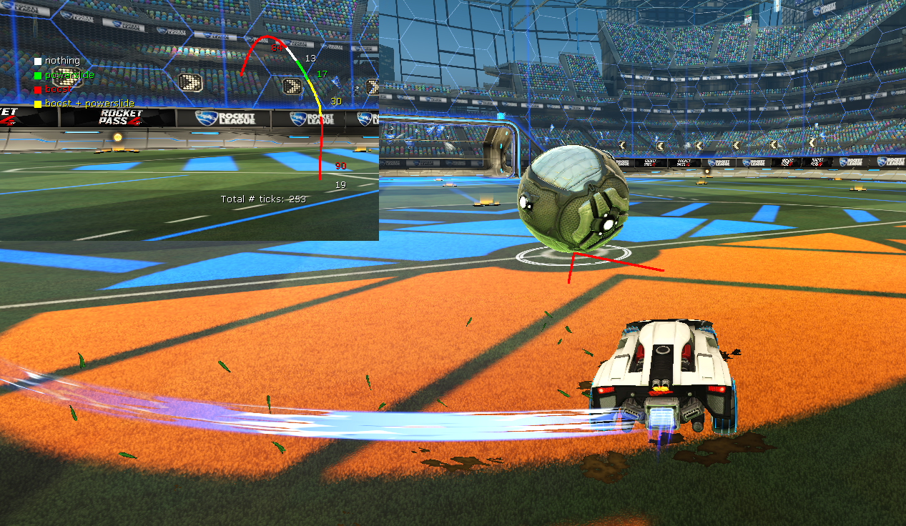

# Turning plugin

Plugin for BakkesMod that helps with practicing (precise) turning on the ground.

#### Main features:
- Lets you practice ground turning by only allowing hitting the ball from a certain angle.
- Visualizes turns with a graph showing the turning path and the number of physics ticks you held different combinations of controller/keyboard inputs.

## Modes
In freeplay, there are two modes: `Fixed turn` and `Free roam`. Choose the mode in the plugin settings menu (F2->Plugins->Turning Plugin).
### Fixed turn
The ball spawns in the center of the field, and the car starts at a fixed location relative to it. The goal is to hit the ball from the right angle, indicated by lines leading towards the ball.
When the ball is hit, a graph is shown, visualizing the path the car took on the ground. Different colors indicate the combination of controller/keyboard inputs held during that segment of the path. The numbers next to them are the number of physics ticks this input segment lasted. (There are exactly 120 ticks in one second).
Reset the shot with the `turn_reset` command. The easiest way to do this is to bind it to a button (F2->Bindings), e.g. one of the dpad buttons.

The settings menu (F2->Plugins->Turning Plugin) provides the following configuration options:
- Starting location, orientation and speed of the car
- Starting speed of the ball
- Target angle and accuracy for hitting the ball
- Whether to freeze ball and car if ball is hit from incorrect angle
- Whether to display turning graph
- Graph scale and location, and kinds of input to distinguish with colors

### Free roam
A graph visualizing the turning path is shown after each turn while driving in freeplay. A turn is considered to have ended after driving straight for 30 physics ticks by default. This number can be changed in the settings menu.

### Custom training
If enabled in the settings menu, a turning graph is also shown after hitting the ball in a custom training shot. This is most relevant in training packs for ground shots, where you might want to practice the perfect turn into the ball.

Contact: [BakkesMod discord](http://discord.gg/HsM6kAR) or DM @Arator#5686
